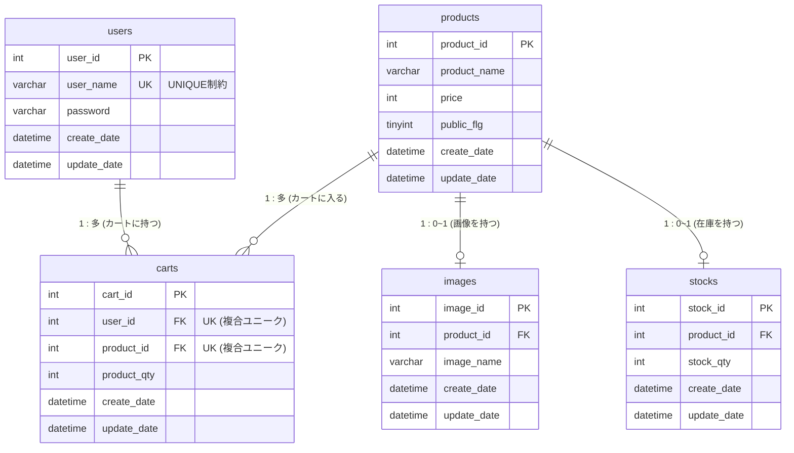

# ER図

```mermaid
erDiagram
    users ||--o{ carts : "1 : 多 (カートに持つ)"
    products ||--o{ carts : "1 : 多 (カートに入る)"
    products ||--o| images : "1 : 0~1 (画像を持つ)"
    products ||--o| stocks : "1 : 0~1 (在庫を持つ)"

    users {
        int user_id PK
        varchar user_name UK "UNIQUE制約"
        varchar password
        datetime create_date
        datetime update_date
    }

    products {
        int product_id PK
        varchar product_name
        int price
        tinyint public_flg
        datetime create_date
        datetime update_date
    }

    images {
        int image_id PK
        int product_id FK
        varchar image_name
        datetime create_date
        datetime update_date
    }

    stocks {
        int stock_id PK
        int product_id FK
        int stock_qty
        datetime create_date
        datetime update_date
    }

    carts {
        int cart_id PK
        int user_id FK "UK (複合ユニーク)"
        int product_id FK "UK (複合ユニーク)"
        int product_qty
        datetime create_date
        datetime update_date
    }
```
